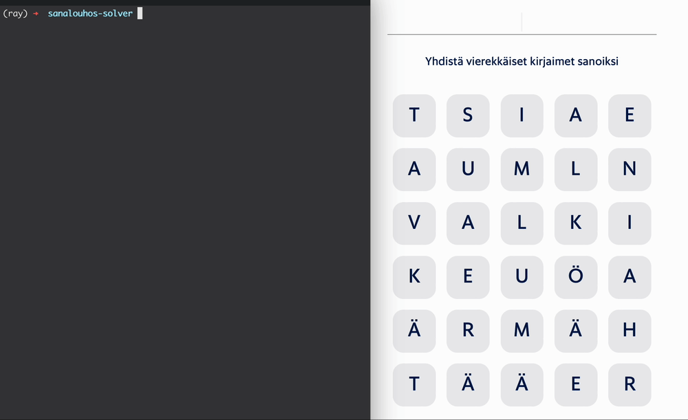

# Sanalouhos solver

> [!NOTE]  
> The algorithm falsely assumes that the words must *not* cross each other diagonally. I'll let it be, no plans to fix it for now :)

A simple python script for solving the Sanalouhos word puzzle game created by
Helsingin Sanomat.



## How does it work?

1. The script finds all possible words from the given letters using depth-first
   search . The logic is borrowed from my old Sanajahti solver. The vocabulary
   is based on the 2024 Kotus word list containing all Finnish words [[1]](#1).

2. The subset of words that cover the entire word grid are found using the
   [Knuth's Algorithm X](https://en.wikipedia.org/wiki/Knuth%27s_Algorithm_X)
   which provides an elegant way to solve the problem. The exact implementation
   is based on
   [Ali Assaf's implementation](https://www.cs.mcgill.ca/~aassaf9/python/algorithm_x.html).

The code is not optimized for performance, but it works well for the given
problem size.

## Usage

The script is written in pure Python and does not require any additional
dependencies. Make sure to keep the word list `kotus2024.txt` in the same
directory.

Cd to the directory containing the script and run the following command:

```bash
python solver.py \
    --letters "tsiaeaumlnvalkikeuöaärmähtääer" \
    --ncol 5 --nrow 6
```

## References

<a id="1">[1]</a> Kotimaisten kielten keskus. (2024). Nykysuomen sanalista.
Kotimaisten kielten keskus. Available at
https://kaino.kotus.fi/lataa/nykysuomensanalista2024.csv
